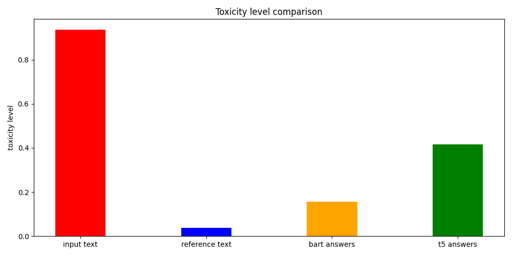
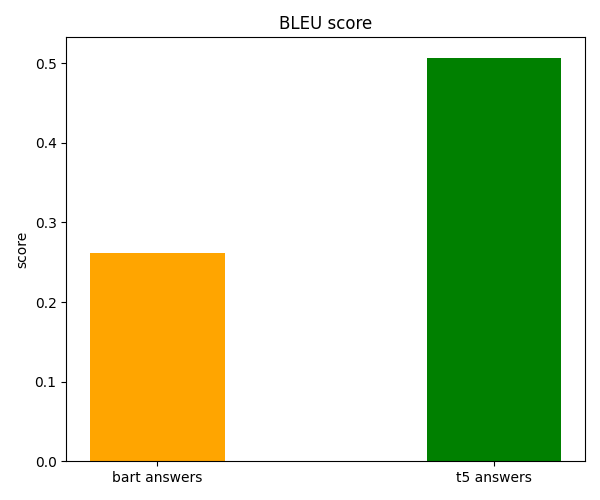
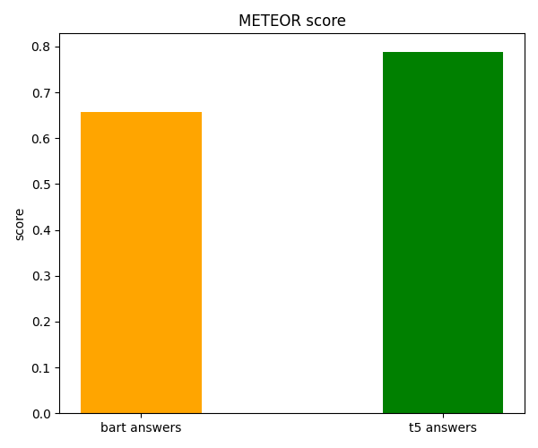

# Final Solution Report

## Introduction

Text Detoxification Task is a process of transforming the text with toxic style into the text with the same meaning but with neutral style. Our task was to create a solution for detoxing text with high level of toxicity. For this task I found two models: BART-paraphrase and T5.

## Data analysis

In given dataset there are 577777 rows. Dataset contains 6 columns: ```reference```, ```translation```, ```similarity```, ```lenght_diff```, ```ref_tox``` and ```trn_tox```. ```ref_tox``` and ```trn_tox``` shows the measure of toxicity for ```reference``` and ```translation``` respectively.

First of all, there is a typo in dataset column name ```lenght_diff``` and it shpuld be fixed.

So, there are several problems:

- For some rows reference is more toxic than translation and otherwise.
- For our task we want to work with pairs of very toxic and almost non-toxic sentences.

In order to overcome this difficulties let's perform the following thing:

- Get all entries where ```ref_tox```> ```toxicity_threshold``` and ```trn_tox```< ```non_toxicity_threshold```, rename ```reference``` column as ```toxic``` and ```translation``` column as ```non-toxic```
- Get all entries where ```trn_tox```> ```toxicity_threshold``` and ```ref_tox```< ```non_toxicity_threshold``` , rename ```reference``` column as ```non-toxic``` and ```translation``` column as ```toxic```
- Concatenate entries of resulting tables

As values for thresholds I decided to use 0.95 for ```toxicity_threshold``` and 0.05 for ```non_toxicity_threshold```.

I also tried to limit our data with ```length_diff``` and ```similarity``` parameters. However I haven't found any reason to use them.

## Models Specifications

### BART

- Bart uses a standard seq2seq/machine translation architecture with a bidirectional encoder (like BERT) and a left-to-right decoder (like GPT).
- The pretraining task involves randomly shuffling the order of the original sentences and a novel in-filling scheme, where spans of text are replaced with a single mask token.
- BART is particularly effective when fine tuned for text generation but also works well for comprehension tasks. It matches the performance of RoBERTa with comparable training resources on GLUE and SQuAD, achieves new state-of-the-art results on a range of abstractive dialogue, question answering, and summarization tasks, with gains of up to 6 ROUGE.

Hyperparameters:

| parameter      	| value 	|
|----------------	|-------	|
| lr             	| 1e-4  	|
| epoch          	| 10    	|
| weight_decay   	| 0.01  	|
| batch_size     	| 32    	|
| max_seq_length 	| 64    	|

### T5-base

T5, or Text-to-Text Transfer Transformer, is a Transformer based architecture that uses a text-to-text approach. Every task – including translation, question answering, and classification – is cast as feeding the model text as input and training it to generate some target text. This allows for the use of the same model, loss function, hyperparameters, etc. across our diverse set of tasks.

Hyperparameters:

| parameter      	| value 	|
|----------------	|-------	|
| lr             	| 3e-4  	|
| epoch          	| 2     	|
| weight_decay   	| 0.0-  	|
| batch_size     	| 32    	|
| max_seq_length 	| 64    	|
| adam_epsilon   	| 1e-8  	|
| warmup_steps   	| 0     	|
| opt_level      	| 'O1'  	|
| max_grad_norm  	| 1.0   	|

## Training process

Both models were trained on [kaggle](https://www.kaggle.com/).

Due to resource limitations, train set size was 10000 rows, validation 1000 rows, test 1000 rows.

For all input data in BART model I used special prefix `"paraphrase to be nontoxic: \n"` to show BART the task. As for target sentence, I haven't change anything.

For T5 model I used the following construction for input data: `input = "detoxify: "+ question + ' </s>'`.
For target sentence I used `target = target + " </s>"`. I had to use `</s>` to show end of input text.

Since both models have their own tokenizers, I used them.

For T5 tuning I used pytorch lightning and trainer class from it.

For BART tuning I used transformers trainer class.

## Evaluation

For evaluation I generated labels with help of [toxicity classifier](https://huggingface.co/s-nlp/roberta_toxicity_classifier) from given by PMLDL team [paper](https://arxiv.org/abs/2109.08914). With that labels I calculated average toxicity level for each column (```toxic```, ```non-toxic```, ```bart```, ```t5```) and got the following plot:



As we can see, both models significantly decreased toxicity level.

In order to measure how good generated sentences are, I used the following metrics:

- [BLEU](https://huggingface.co/spaces/evaluate-metric/bleu) (Bilingual Evaluation Understudy) is an algorithm for evaluating the quality of text which has been machine-translated from one natural language to another. Quality is considered to be the correspondence between a machine’s output and that of a human.
- [METEOR](https://huggingface.co/spaces/evaluate-metric/meteor) (Metric for Evaluation of Translation with Explicit ORdering) is an automatic metric for machine translation evaluation that is based on a generalized concept of unigram matching between the machine-produced translation and human-produced reference translations.

This metrix are used to estimate machine translation. However, over task is also some kind of translation from toxic language to non-toxic one.

I'be got following plots:




As we can see, t5 has better results. However if we'd take into consideration the fact, that BART model has almost 2 times lower toxicity level. This means that in T5 answers there are greater amount of toxic words, which might influence on both BLEU and METEOR scores.

## Results

The results of this assignment is quite fascinating. Both models successfully decreased toxicity level more than 2 times. BART model outperformed T5. The reason for this might be the fact, that BART is good at comprehension tasks, which are connected to our problem in some sense. As for T5 model - it's more multipurpose, which also might influence on results.
